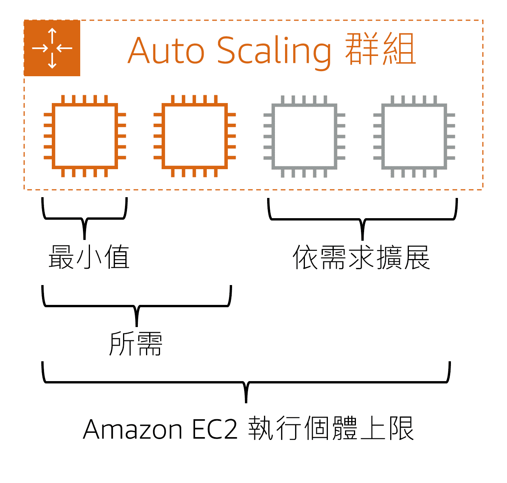

# Amazon EC2 Auto Scaling 完整指南

## 🎯 什麼是 Auto Scaling？

Amazon EC2 Auto Scaling 是一種自動調整運算資源的服務，能夠根據應用程式需求自動新增或移除 EC2 執行個體。就像是一個**智慧管家**，幫你管理伺服器數量。

### 🏪 實際比喻：咖啡店員工管理
想像你經營一家咖啡店：
- **平常時間**：2 名員工就夠了（最小值）
- **尖峰時間**：需要 4 名員工應付人潮（所需值）
- **特殊活動**：最多可以叫 6 名員工（最大值）

Auto Scaling 就是自動幫你決定什麼時候需要多少員工！

---

## 🔧 Auto Scaling 群組運作示意



*圖說：Auto Scaling 群組會根據最小值、所需值與需求自動調整 EC2 執行個體數量。*

---

## 📊 Auto Scaling 群組的三個核心參數

### 1. 🚪 最小值 (Minimum Capacity)
- **定義**：群組中必須維持的最小執行個體數量
- **用途**：確保服務始終可用
- **範例**：設定最小值為 2，即使沒有流量也會保持 2 個執行個體運行

### 2. 🎯 所需值 (Desired Capacity)
- **定義**：理想的執行個體數量
- **用途**：正常營運時的標準配置
- **範例**：設定所需值為 3，系統會嘗試維持 3 個執行個體

### 3. 🚀 最大值 (Maximum Capacity)
- **定義**：群組可擴展的最大執行個體數量
- **用途**：控制成本，避免無限擴展
- **範例**：設定最大值為 8，即使流量暴增也不會超過 8 個執行個體

---

## 🎛️ 擴展觸發條件

### 基於指標的自動擴展
| 指標類型 | 觸發條件 | 實際應用 |
|----------|----------|----------|
| **CPU 使用率** | > 70% 擴展，< 30% 縮減 | 運算密集型應用 |
| **記憶體使用率** | > 80% 擴展，< 40% 縮減 | 記憶體密集型應用 |
| **網路流量** | 高流量時擴展 | Web 應用程式 |
| **請求數量** | 每分鐘請求 > 1000 | API 服務 |

### 基於排程的自動擴展
```
實際場景：電商網站
- 平日 09:00-18:00：維持 4 個執行個體
- 週末全天：維持 6 個執行個體  
- 促銷活動期間：維持 10 個執行個體
- 深夜 02:00-06:00：縮減到 2 個執行個體
```
---

## 🔄 Auto Scaling 運作流程

### 1. 監控階段
```
CloudWatch 持續監控：
├─ CPU 使用率
├─ 記憶體使用率
├─ 網路流量
└─ 應用程式指標
```

### 2. 決策階段
```
評估是否需要擴展：
├─ 檢查觸發條件
├─ 確認冷卻時間
├─ 驗證容量限制
└─ 選擇擴展策略
```

### 3. 執行階段
```
執行擴展動作：
├─ 啟動新執行個體（擴展）
├─ 或終止執行個體（縮減）
├─ 更新負載均衡器
└─ 記錄操作日誌
```

---

## 🎉 優勢總結

### 成本效益
- **按需付費**：只為實際使用的資源付費
- **避免過度佈建**：不需要提前購買大量伺服器
- **優化資源利用率**：自動調整以提高效率

### 可靠性
- **自動故障恢復**：自動替換故障的執行個體
- **高可用性**：分布在多個可用區
- **無需人工干預**：24/7 自動管理

### 靈活性
- **快速響應**：根據需求快速調整
- **可預測性**：支援排程式擴展
- **可擴展性**：支援從小型到大型應用